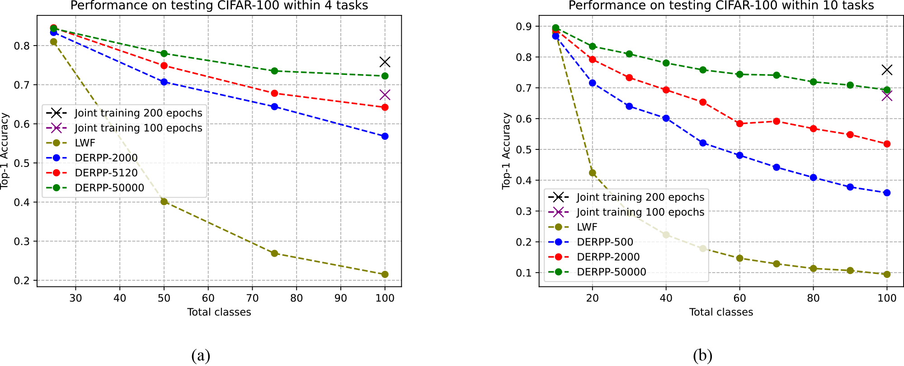
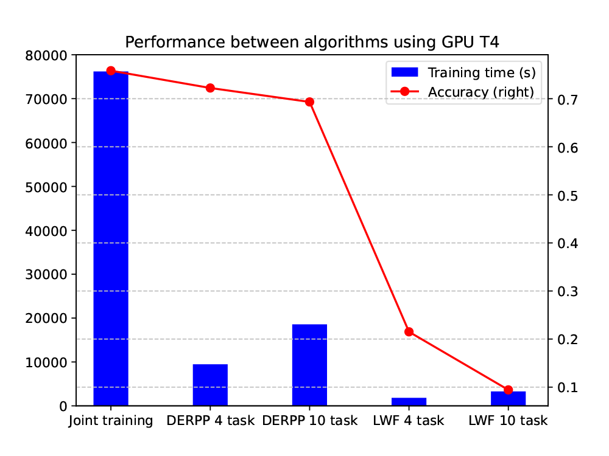
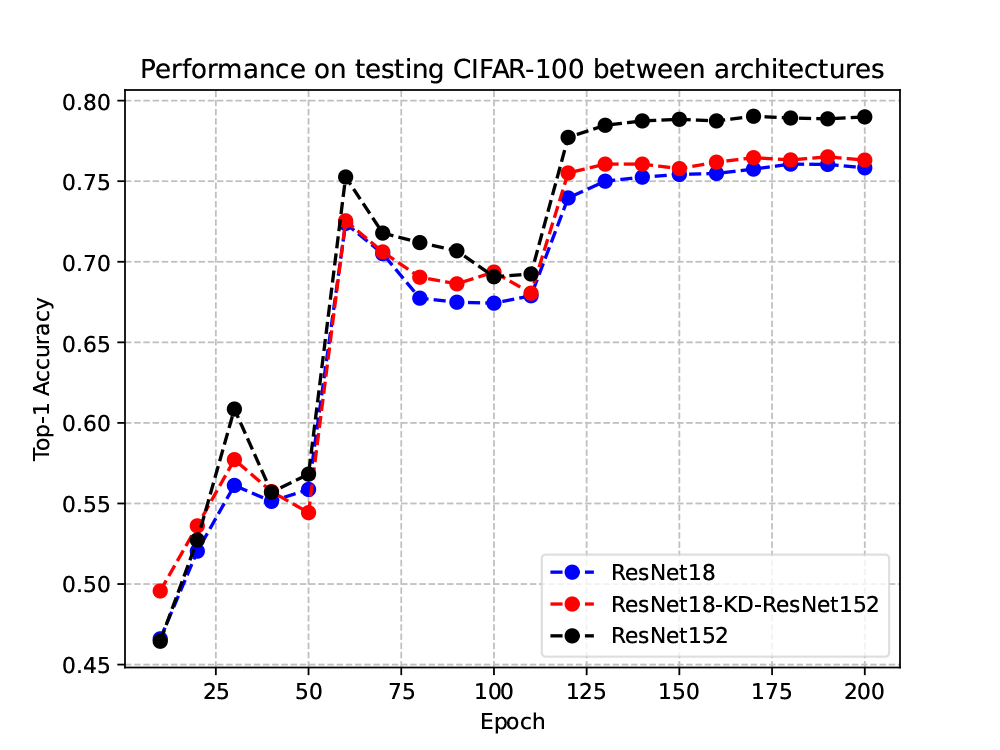

# Overcoming limited training resources using Continual learning

Official repository of [Overcoming limited training resources using Continual learning](https://drive.google.com/file/d/1lJvIE7s-jQ7ejPeO3tbp9oLcPdgPYrWi/view?usp=sharing)

## Checkpoint
### 1. Joint training
[ResNet152](https://drive.google.com/drive/folders/1-6clW17ZCWbbG6rSpyl8oNAt9ZCgF1Xm?usp=sharing) | [ResNet18](https://drive.google.com/drive/folders/1mH4I2_F4wul8iPmzslvs0C5SnK4E2bqJ?usp=sharing) | [ResNet18-KD-ResNet152](https://drive.google.com/drive/folders/12S8qqI0az9xWQvMT3CtPotOsituyUyju?usp=sharing)

### 2. Continual Learning
These Continual Learning methods using ResNet18 backbone can be found [here](https://drive.google.com/drive/folders/1eRNhJXb_bgUCshyqcaz1hlN5uqqKLSxA?usp=sharing).

## Joint training

### 1. Requirements
```
pip install -r requirements.txt
```

### 2. Train the baseline model
You need to specify the net you want to train using arg `-net`

```
# use gpu to train resnet152 or resnet18
python train.py -net resnet152 -gpu True
```

### 3. Train the model using Knowledge Distillation
```
# train resnet18 distilled the knowledge from resnet152
pyhon !python train_distillation.py -net resnet18 -gpu True -teacher_net resnet152 -teacher_checkpoint 'teacher_checkpoint'
```

### 4. Test the model
Test the model using `test_full.py`
```
python test_full.py -net resnet152 -weights_full 'checkpoint_dir'
```

## Continual learning
```
cd continual/
```
Define the specific number of tasks and classes per task in `datasets/seq-cifar100.py`.

### 1. Requirements
```
pip install -r requirements.txt
```

### 2. Run experiments on LwF
Train the model using `main.py`
```
python utils/main.py --model lwf --dataset seq-cifar100 --lr 0.01 --alpha 3.0 --softmax_temp 2.0 --batch_size 32 --optim_wd 0.0005 --n_epochs 100
```

### 3. Run experiments on DER++
Train the model using `main.py` with `--buffer_size` are 500, 2000, 5120 and 50000.
```
python utils/main.py --model derpp --dataset seq-cifar100 --buffer_size 2000 --lr 0.03 --minibatch_size 32 --batch_size 32 --alpha 0.1 --beta 0.5 --n_epochs 100
```

## Results


### Continual learning methods
<p align="center">
  
</p>

### Training time
<p align="center">
  
</p>

### Knowledge distillation approach
<p align="center">
  
</p>


